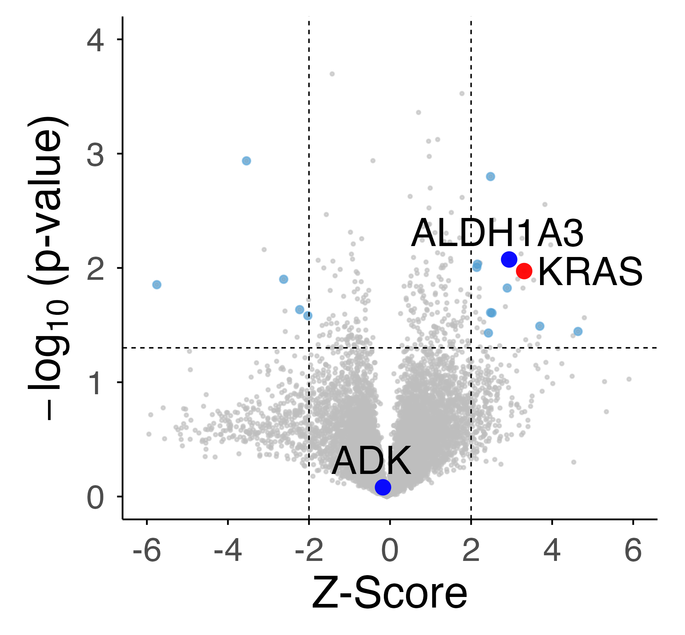
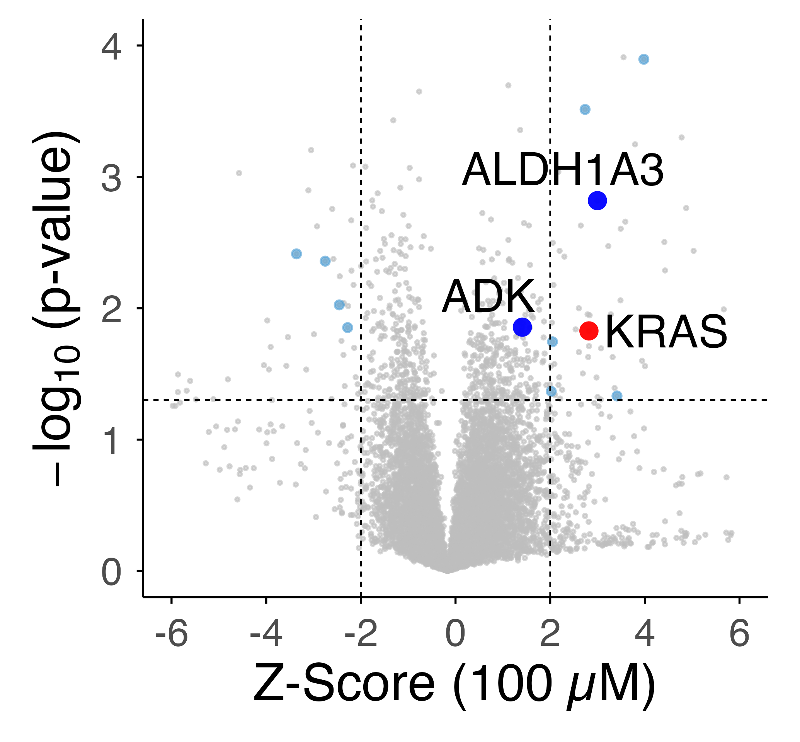
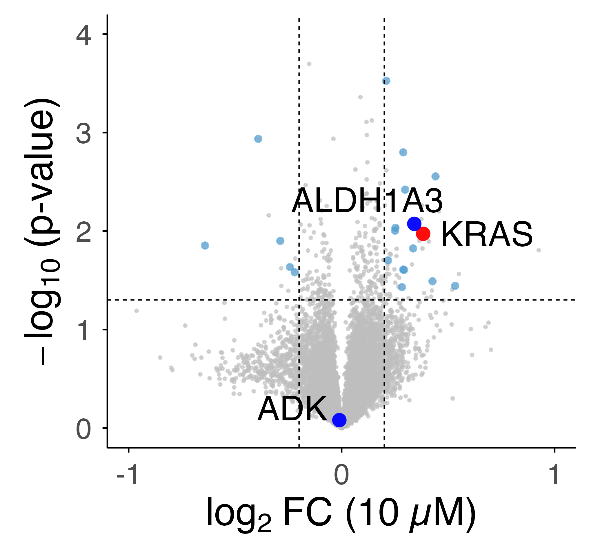
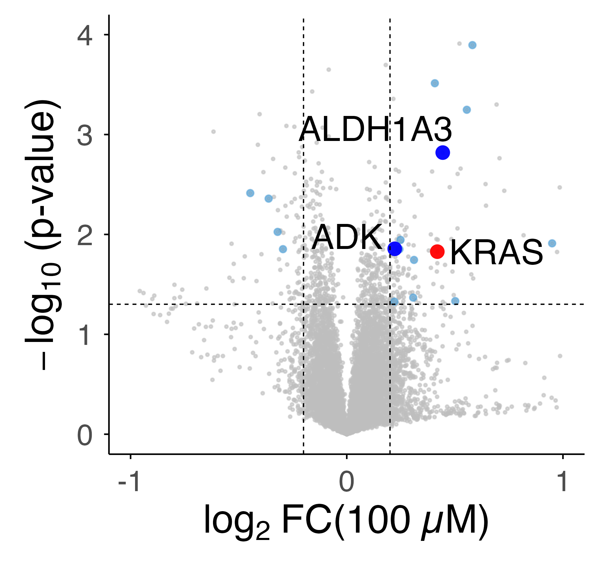
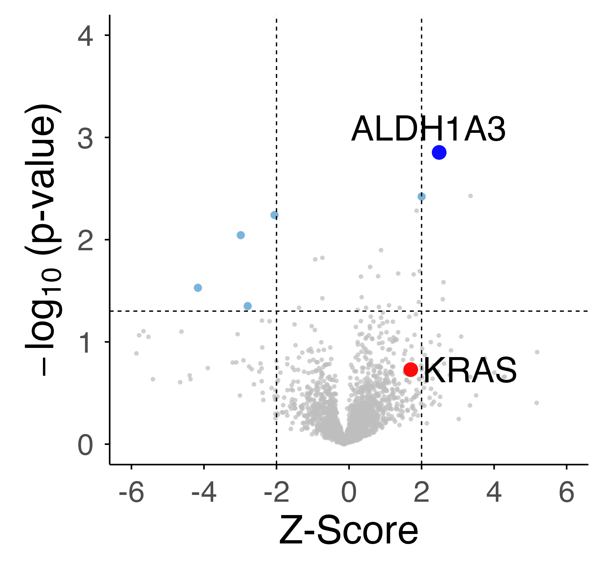
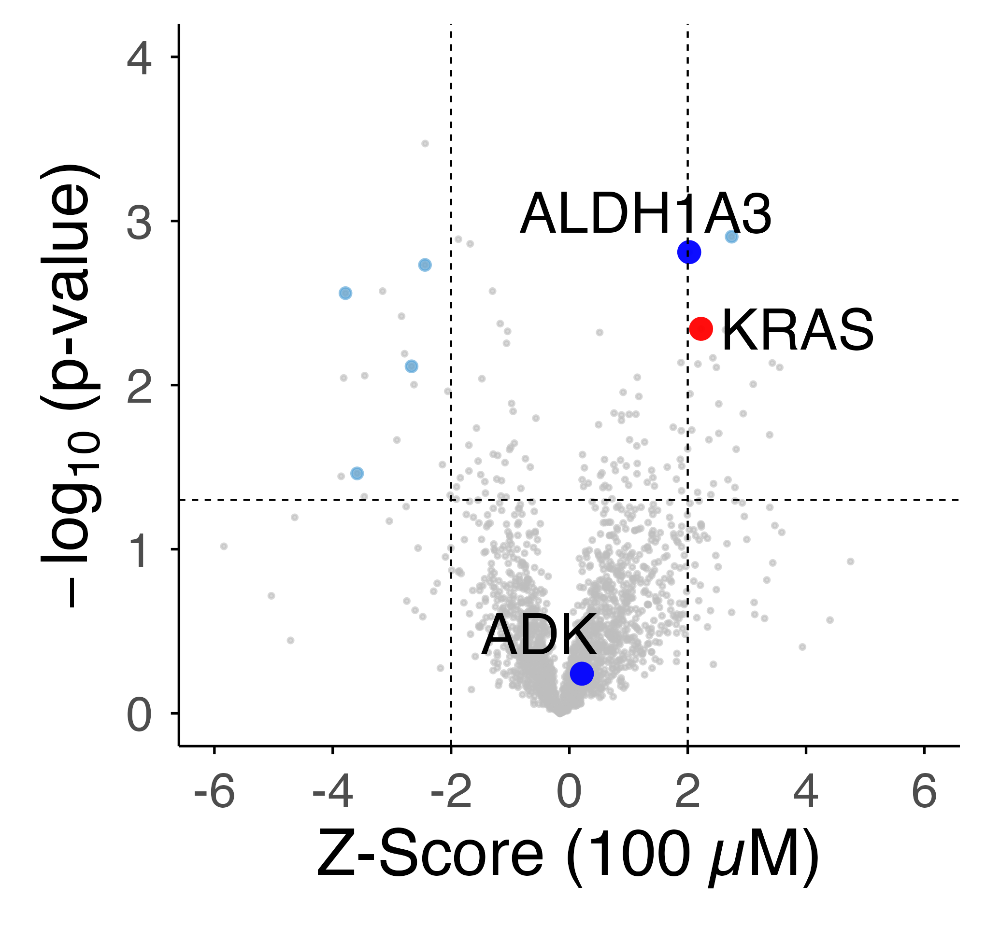
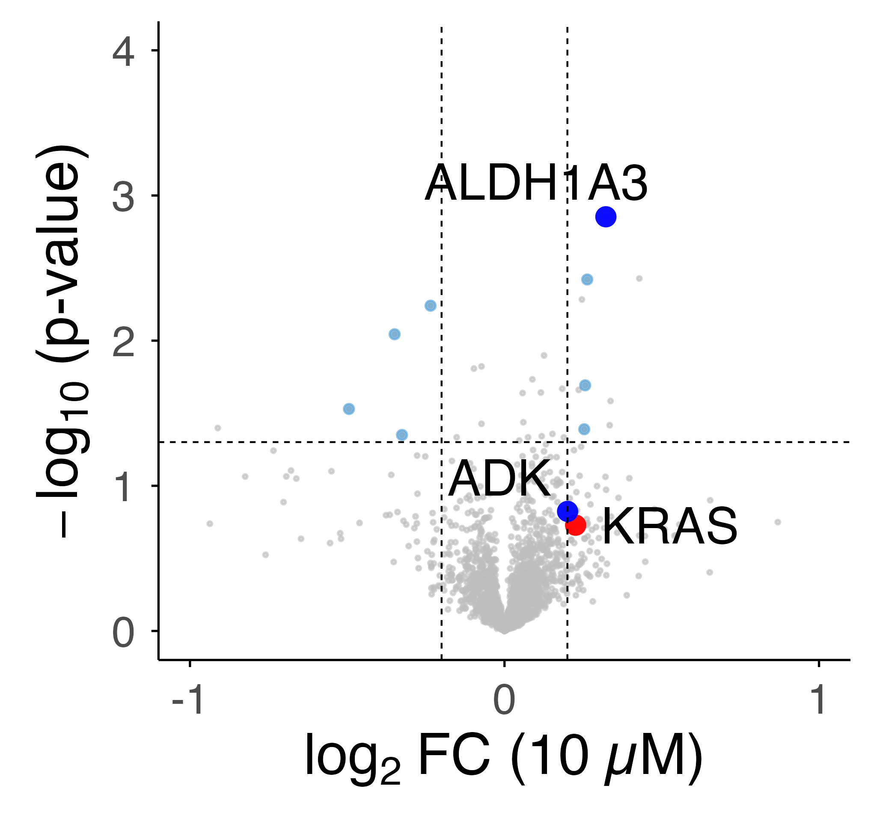
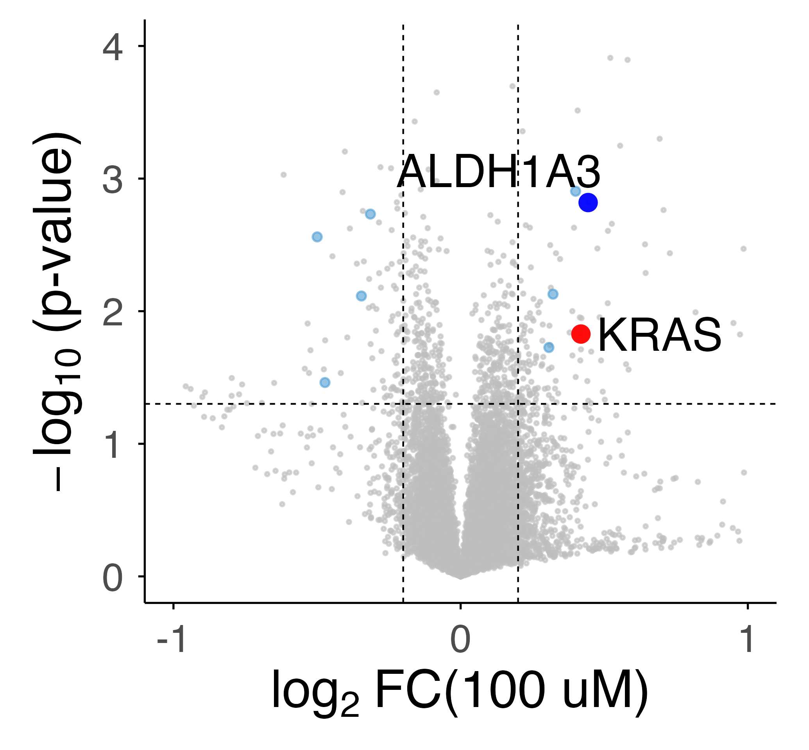

# ARS-1620 Proteomics and Activity Analysis

This repository contains R code for analysis of ARS-1620 experimental data, including:

- one-pot SPROX analysis
- one-pot TPP analysis
- volcano plot generation
- ALDH1A3 enzymatic activity analysis

The workflow includes data import, filtering, normalization, Welch t tests, hit selection, UniProt annotation, and figure generation.

---

## Repository contents

This project includes analysis for:

1. UniProt annotation import and preprocessing
2. One-pot SPROX data analysis
3. One-pot TPP data analysis
4. Volcano plots using Z-scores
5. Volcano plots using log2 fold changes
6. ALDH1A3 enzymatic activity assay analysis

---

## Requirements

### Software

- R
- RStudio recommended

### Required R packages

```r
library(tidyverse)
library(tidyr)
library(readxl)
library(dplyr)
library(ggplot2)
library(rentrez)
library(Biostrings)
library(openxlsx)
library(ggrepel)
library(readr)
library(stringr)
library(forcats)
library(RColorBrewer)
```

## UniProt annotation and one-pot SPROX analysis

### Read UniProt annotation file

The analysis begins by reading the UniProt human proteome annotation file and keeping the accession and gene name fields for downstream annotation.

```r
uniprot_proteome_Homo_Sapiens <- read_tsv("SPROX/Data/uniprotkb_proteome_UP000005640_2024_09_23.tsv")

names(uniprot_proteome_Homo_Sapiens)[1] <- "Master_Protein_Accession"
names(uniprot_proteome_Homo_Sapiens)[3] <- "Protein_names"
names(uniprot_proteome_Homo_Sapiens)[4] <- "Gene_Name"

uniprot_proteome <- uniprot_proteome_Homo_Sapiens %>%
  dplyr::select(Master_Protein_Accession, Gene_Name) %>%
  filter(!duplicated(.))
```

### SPROX analysis

```r
# Read one-pot SPROX data
SPROX_Met_Enrich <- read_excel("SPROX/Data/ARS_1620_Enrich_non_scale.xlsx")

# rename the columns
names(SPROX_Met_Enrich)[3] <- "Annotated_Sequence"
names(SPROX_Met_Enrich)[10] <- "Master_Protein_Accessions" 
names(SPROX_Met_Enrich)[11] <- "Positions_in_Master_Proteins" 
names(SPROX_Met_Enrich)[15] <- "Control_1"
names(SPROX_Met_Enrich)[16] <- "Control_2"
names(SPROX_Met_Enrich)[17] <- "Control_3"
names(SPROX_Met_Enrich)[18] <- "Control_4"
names(SPROX_Met_Enrich)[19] <- "ten_uM_1"
names(SPROX_Met_Enrich)[20] <- "ten_uM_2"
names(SPROX_Met_Enrich)[21] <- "ten_uM_3"
names(SPROX_Met_Enrich)[22] <- "hundred_uM_1"
names(SPROX_Met_Enrich)[23] <- "hundred_uM_2"
names(SPROX_Met_Enrich)[24] <- "hundred_uM_3"

# select the columns for further analysis
SPROX_Met_Enrich_fil <- SPROX_Met_Enrich %>% 
  mutate(sequence = sub("^\\[.+\\]\\.(.+)\\..+$", "\\1", `Annotated_Sequence`)) %>% 
  dplyr::select("Master_Protein_Accessions", "Annotated_Sequence", "sequence", "Positions_in_Master_Proteins", "Modifications", 15:24)

# remove missing value, filter for wt-Met
SPROX_Met_Enrich_fil_wt_Met <- SPROX_Met_Enrich_fil %>%
  filter(if_all(c(Control_1, Control_2, Control_3, Control_4,
                  ten_uM_1, ten_uM_2, ten_uM_3,
                  hundred_uM_1, hundred_uM_2, hundred_uM_3), ~ !is.na(.))) %>% 
  filter(grepl("M", sequence)) %>% 
  filter(!grepl("Oxidation", Modifications))

# calculate the normalization factor, This normalization step mitigates the TMT channel to channel errors (e.g., differential sample loss and/or isobaric mass tag labeling efficiency). 
SPROX_norm_1 = sum(SPROX_Met_Enrich_fil_wt_Met$Control_1, na.rm = TRUE)/sum(SPROX_Met_Enrich_fil_wt_Met$Control_1, na.rm = TRUE)
SPROX_norm_2 = sum(SPROX_Met_Enrich_fil_wt_Met$Control_2, na.rm = TRUE)/sum(SPROX_Met_Enrich_fil_wt_Met$Control_1, na.rm = TRUE)
SPROX_norm_3 = sum(SPROX_Met_Enrich_fil_wt_Met$Control_3, na.rm = TRUE)/sum(SPROX_Met_Enrich_fil_wt_Met$Control_1, na.rm = TRUE)
SPROX_norm_4 = sum(SPROX_Met_Enrich_fil_wt_Met$Control_4, na.rm = TRUE)/sum(SPROX_Met_Enrich_fil_wt_Met$Control_1, na.rm = TRUE)
SPROX_norm_5 = sum(SPROX_Met_Enrich_fil_wt_Met$ten_uM_1, na.rm = TRUE)/sum(SPROX_Met_Enrich_fil_wt_Met$Control_1, na.rm = TRUE)
SPROX_norm_6 = sum(SPROX_Met_Enrich_fil_wt_Met$ten_uM_2, na.rm = TRUE)/sum(SPROX_Met_Enrich_fil_wt_Met$Control_1, na.rm = TRUE)
SPROX_norm_7 = sum(SPROX_Met_Enrich_fil_wt_Met$ten_uM_3, na.rm = TRUE)/sum(SPROX_Met_Enrich_fil_wt_Met$Control_1, na.rm = TRUE)
SPROX_norm_8 = sum(SPROX_Met_Enrich_fil_wt_Met$hundred_uM_1, na.rm = TRUE)/sum(SPROX_Met_Enrich_fil_wt_Met$Control_1, na.rm = TRUE)
SPROX_norm_9 = sum(SPROX_Met_Enrich_fil_wt_Met$hundred_uM_2, na.rm = TRUE)/sum(SPROX_Met_Enrich_fil_wt_Met$Control_1, na.rm = TRUE)
SPROX_norm_10 = sum(SPROX_Met_Enrich_fil_wt_Met$hundred_uM_3, na.rm = TRUE)/sum(SPROX_Met_Enrich_fil_wt_Met$Control_1, na.rm = TRUE)

# print nromalization factors
SPROX_norm_1 
SPROX_norm_2 
SPROX_norm_3 
SPROX_norm_4 
SPROX_norm_5
SPROX_norm_6 
SPROX_norm_7
SPROX_norm_8 
SPROX_norm_9 
SPROX_norm_10

# > SPROX_norm_1 
# [1] 1
# > SPROX_norm_2 
# [1] 0.9998314
# > SPROX_norm_3 
# [1] 1.003346
# > SPROX_norm_4 
# [1] 1.000769
# > SPROX_norm_5
# [1] 1.001683
# > SPROX_norm_6 
# [1] 0.998944
# > SPROX_norm_7
# [1] 1.001597
# > SPROX_norm_8 
# [1] 0.9992734
# > SPROX_norm_9 
# [1] 1.003763
# > SPROX_norm_10 
# [1] 1.003005

# apply normalization factor to each column
SPROX_Met_Enrich_fil_wt_Met_norm <- SPROX_Met_Enrich_fil_wt_Met %>% 
  mutate(Control_1 = Control_1/SPROX_norm_1) %>% 
  mutate(Control_2 = Control_2/SPROX_norm_2) %>% 
  mutate(Control_3 = Control_3/SPROX_norm_3) %>% 
  mutate(Control_4 = Control_4/SPROX_norm_4) %>% 
  mutate(ten_uM_1 = ten_uM_1/SPROX_norm_5) %>% 
  mutate(ten_uM_2 = ten_uM_2/SPROX_norm_6) %>% 
  mutate(ten_uM_3 = ten_uM_3/SPROX_norm_7) %>% 
  mutate(hundred_uM_1 = hundred_uM_1/SPROX_norm_8) %>% 
  mutate(hundred_uM_2 = hundred_uM_2/SPROX_norm_9) %>% 
  mutate(hundred_uM_3 = hundred_uM_3/SPROX_norm_10) %>% 
  mutate(Master_Protein_Accession = str_extract(Master_Protein_Accessions, "^[^;-]+")) %>% 
  dplyr::select(Master_Protein_Accession, 2:15) 

# perform Welch's t-test for wt Met
SPROX_Met_Enrich_fil_wt_Met_norm_Welch_t_test <- SPROX_Met_Enrich_fil_wt_Met_norm %>% 
  rowwise() %>%
  mutate(
    # =======================
    # 10 uM: 6:9 vs 10:12
    # =======================
    fold_change_ten_uM = {
      x <- as.numeric(c_across(6:9))
      y <- as.numeric(c_across(10:12))
      x <- x[!is.na(x)]
      y <- y[!is.na(y)]
      if (length(x) > 0 && length(y) > 0) mean(y) / mean(x) else NA_real_
    },

    log2FC_ten_uM = if (!is.na(fold_change_ten_uM) && fold_change_ten_uM > 0) {
      log2(fold_change_ten_uM)
    } else {
      NA_real_
    },
    
    p_value_ten_uM = {
      x <- as.numeric(c_across(6:9))
      y <- as.numeric(c_across(10:12))
      x <- x[!is.na(x)]
      y <- y[!is.na(y)]
      if (length(x) >= 2 && length(y) >= 2) t.test(x, y)$p.value else NA_real_
    },
    
    neg_log10_p_value_ten_uM = if (!is.na(p_value_ten_uM) && p_value_ten_uM > 0) {
      -log10(p_value_ten_uM)
    } else {
      NA_real_
    },
    
    # =======================
    # 100 uM: 6:9 vs 13:15
    # =======================
    fold_change_hundred_uM = {
      x <- as.numeric(c_across(6:9))
      y <- as.numeric(c_across(13:15))
      x <- x[!is.na(x)]
      y <- y[!is.na(y)]
      if (length(x) > 0 && length(y) > 0) mean(y) / mean(x) else NA_real_
    },
    
    log2FC_hundred_uM = if (!is.na(fold_change_hundred_uM) && fold_change_hundred_uM > 0) {
      log2(fold_change_hundred_uM)
    } else {
      NA_real_
    },
    
    p_value_hundred_uM = {
      x <- as.numeric(c_across(6:9))
      y <- as.numeric(c_across(13:15))
      x <- x[!is.na(x)]
      y <- y[!is.na(y)]
      if (length(x) >= 2 && length(y) >= 2) t.test(x, y)$p.value else NA_real_
    },
    
    neg_log10_p_value_hundred_uM = if (!is.na(p_value_hundred_uM) && p_value_hundred_uM > 0) {
      -log10(p_value_hundred_uM)
    } else {
      NA_real_
    }
  ) %>%
  ungroup() %>% 
  mutate(
    # BH-FDR adjusted p values
    adj_p_value_ten_uM = p.adjust(p_value_ten_uM, method = "BH"),
    adj_p_value_hundred_uM = p.adjust(p_value_hundred_uM, method = "BH"),
    
    # Z-scores
    log2FC_ten_uM_avg = mean(log2FC_ten_uM, na.rm = TRUE),
    log2FC_ten_uM_sd  = sd(log2FC_ten_uM, na.rm = TRUE),
    Z_Score_ten_uM    = (log2FC_ten_uM - log2FC_ten_uM_avg) / log2FC_ten_uM_sd,
    
    log2FC_hundred_uM_avg = mean(log2FC_hundred_uM, na.rm = TRUE),
    log2FC_hundred_uM_sd  = sd(log2FC_hundred_uM, na.rm = TRUE),
    Z_Score_hundred_uM    = (log2FC_hundred_uM - log2FC_hundred_uM_avg) / log2FC_hundred_uM_sd
  )

SPROX_Met_Enrich_fil_wt_Met_norm_Welch_t_test_Gene_Name <- SPROX_Met_Enrich_fil_wt_Met_norm_Welch_t_test %>% 
  left_join(
    uniprot_proteome,
    by = "Master_Protein_Accession"
  )

# filter for hits
SPROX_Hits_ten_uM <- SPROX_Met_Enrich_fil_wt_Met_norm_Welch_t_test_Gene_Name %>%
  filter(p_value_ten_uM < 0.05) %>% 
  filter(abs(Z_Score_ten_uM) > 2) %>% 
  dplyr::select(Gene_Name) %>% 
  distinct()

SPROX_Hits_hundred_uM <- SPROX_Met_Enrich_fil_wt_Met_norm_Welch_t_test_Gene_Name %>%
  filter(p_value_hundred_uM < 0.05) %>% 
  filter(abs(Z_Score_hundred_uM) > 2) %>% 
  dplyr::select(Gene_Name) %>% 
  distinct()

SPROX_Hits_overlapped <- inner_join(
  SPROX_Hits_ten_uM, 
  SPROX_Hits_hundred_uM) %>% 
  distinct()

#plot the result

# plot the volcano plots with Z-Score.
SPROX_Hits_overlapped_plot <- SPROX_Hits_overlapped %>% 
  left_join(SPROX_Met_Enrich_fil_wt_Met_norm_Welch_t_test_Gene_Name) %>% 
  filter(p_value_ten_uM < 0.05) %>% 
  filter(abs(Z_Score_ten_uM) > 2) %>% 
  filter(p_value_hundred_uM < 0.05) %>% 
  filter(abs(Z_Score_hundred_uM) > 2) %>% 
  filter(!Gene_Name == "ALDH1A3") %>% 
  filter(!Gene_Name == "KRAS")

# SPROX_10uM
SPROX_10uM <- ggplot() +
  # Background
  geom_point(data = SPROX_Met_Enrich_fil_wt_Met_norm_Welch_t_test_Gene_Name, aes(x = Z_Score_ten_uM, y = neg_log10_p_value_ten_uM), color = "grey", size = 0.3, alpha = 0.6) +
  # overlapped proteins
  geom_point(data = SPROX_Hits_overlapped_plot, aes(x = Z_Score_ten_uM, y = neg_log10_p_value_ten_uM), color = "#4B9CD3", size = 1, alpha = 0.6) +
  # KRAS
  geom_point(
    data = subset(SPROX_Met_Enrich_fil_wt_Met_norm_Welch_t_test_Gene_Name, Gene_Name == "KRAS" & sequence == "VKDSEDVPMVLVGNK"), 
    aes(x = Z_Score_ten_uM, y = neg_log10_p_value_ten_uM), color = "red", size = 2.5, alpha = 0.95, shape = 16) +
  geom_text_repel(
    data = subset(SPROX_Met_Enrich_fil_wt_Met_norm_Welch_t_test_Gene_Name, Gene_Name == "KRAS" & sequence == "VKDSEDVPMVLVGNK"),
    aes(x = Z_Score_ten_uM, y = neg_log10_p_value_ten_uM, label = Gene_Name), size = 5, box.padding = 0.25, point.padding = 0.25, nudge_x = 0.3, nudge_y = 0, color = "black", segment.color = "black", segment.size = 0.25, max.overlaps = Inf) +
  # ALDH1A3
  geom_point(
    data = subset(SPROX_Met_Enrich_fil_wt_Met_norm_Welch_t_test_Gene_Name, Gene_Name == "ALDH1A3" &  sequence == "GLFIKPTVFSEVTDNMR"),
    aes(x = Z_Score_ten_uM, y = neg_log10_p_value_ten_uM), color = "blue", size = 2.5, alpha = 0.95, shape = 16) +
  geom_text_repel(
    data = subset(SPROX_Met_Enrich_fil_wt_Met_norm_Welch_t_test_Gene_Name, Gene_Name == "ALDH1A3" & sequence == "GLFIKPTVFSEVTDNMR"),
    aes(x = Z_Score_ten_uM, y = neg_log10_p_value_ten_uM, label = Gene_Name), size = 5, box.padding = 0.25, point.padding = 0.25, nudge_x = -0.2, nudge_y = 0.2, color = "black", segment.color = "black", segment.size = 0.25, max.overlaps = Inf) +
  # ADK
  geom_point(
    data = subset(SPROX_Met_Enrich_fil_wt_Met_norm_Welch_t_test_Gene_Name, Gene_Name == "ADK" &  sequence == "VAQWMIQQPHK"),
    aes(x = Z_Score_ten_uM, y = neg_log10_p_value_ten_uM), color = "blue", size = 2.5, alpha = 0.95, shape = 16) +
  geom_text_repel(
    data = subset(SPROX_Met_Enrich_fil_wt_Met_norm_Welch_t_test_Gene_Name, Gene_Name == "ADK" & sequence == "VAQWMIQQPHK"),
    aes(x = Z_Score_ten_uM, y = neg_log10_p_value_ten_uM, label = Gene_Name), size = 5, box.padding = 0.25, point.padding = 0.25, nudge_x = -0.2, nudge_y = 0.2, color = "black", segment.color = "black", segment.size = 0.25, max.overlaps = Inf) +
  # Thresholds
  geom_hline(yintercept = -log10(0.05), linetype = "33", color = "black", linewidth = 0.25) +
  geom_vline(xintercept = c(-2, 2), linetype = "33", color = "black", linewidth = 0.25) +
  labs(
    x = expression("Z-Score"),y = expression(-log[10]~"(p-value)")) +
  scale_x_continuous(limits = c(-6, 6), breaks = seq(-6, 6, by = 2), labels = scales::number_format(accuracy = 1)) +
  scale_y_continuous(limits = c(0, 4), breaks = 0:4) +
  theme_minimal(base_size = 10, base_family = "Helvetica") +
  theme(
    legend.position = "none",
    panel.grid.major = element_blank(),
    panel.grid.minor = element_blank(),
    axis.line = element_line(linewidth = 0.3, colour = "black"),
    axis.ticks = element_line(linewidth = 0.3, colour = "black"),
    axis.ticks.length = unit(2, "pt"),
    plot.margin = margin(6, 10, 6, 10),
    axis.title.x = element_text(size = 16, face = "bold"),
    axis.title.y = element_text(size = 16, face = "bold"),
    axis.text = element_text(size = 12))

SPROX_10uM

ggsave("volcano_SPROX_10uM.png", SPROX_10uM,
       device = ragg::agg_png, width = 3.45, height = 3.2, units = "in",
       dpi = 600)

# SPROX_100uM
SPROX_100uM <- ggplot() +
  # Background
  geom_point(data = SPROX_Met_Enrich_fil_wt_Met_norm_Welch_t_test_Gene_Name, aes(x = Z_Score_hundred_uM, y = neg_log10_p_value_hundred_uM), color = "grey", size = 0.3, alpha = 0.6) +
  # overlapped proteins
  geom_point(data = SPROX_Hits_overlapped_plot, aes(x = Z_Score_hundred_uM, y = neg_log10_p_value_hundred_uM), color = "#4B9CD3", size = 1, alpha = 0.6) +
  # KRAS
  geom_point(
    data = subset(SPROX_Met_Enrich_fil_wt_Met_norm_Welch_t_test_Gene_Name, Gene_Name == "KRAS" & sequence == "VKDSEDVPMVLVGNK"), 
    aes(x = Z_Score_hundred_uM, y = neg_log10_p_value_hundred_uM), color = "red", size = 2.5, alpha = 0.95, shape = 16) +
  geom_text_repel(
    data = subset(SPROX_Met_Enrich_fil_wt_Met_norm_Welch_t_test_Gene_Name, Gene_Name == "KRAS" & sequence == "VKDSEDVPMVLVGNK"),
    aes(x = Z_Score_hundred_uM, y = neg_log10_p_value_hundred_uM, label = Gene_Name), size = 5, box.padding = 0.25, point.padding = 0.25, nudge_x = 0.2, nudge_y = 0, color = "black", segment.color = "black", segment.size = 0.25, max.overlaps = Inf) +
  # ALDH1A3
  geom_point(
    data = subset(SPROX_Met_Enrich_fil_wt_Met_norm_Welch_t_test_Gene_Name, Gene_Name == "ALDH1A3" & sequence == "GLFIKPTVFSEVTDNMR"),
    aes(x = Z_Score_hundred_uM, y = neg_log10_p_value_hundred_uM), color = "blue", size = 2.5, alpha = 0.95, shape = 16) +
  geom_text_repel(
    data = subset(SPROX_Met_Enrich_fil_wt_Met_norm_Welch_t_test_Gene_Name, Gene_Name == "ALDH1A3" & sequence == "GLFIKPTVFSEVTDNMR"),
    aes(x = Z_Score_hundred_uM, y = neg_log10_p_value_hundred_uM, label = Gene_Name), size = 5, box.padding = 0.25, point.padding = 0.25, nudge_x = -0.2, nudge_y = 0.1, color = "black", segment.color = "black", segment.size = 0.25, max.overlaps = Inf) +
  # ADK
  geom_point(
    data = subset(SPROX_Met_Enrich_fil_wt_Met_norm_Welch_t_test_Gene_Name, Gene_Name == "ADK" & sequence == "VAQWMIQQPHK"),
    aes(x = Z_Score_hundred_uM, y = neg_log10_p_value_hundred_uM), color = "blue", size = 2.5, alpha = 0.95, shape = 16) +
  geom_text_repel(
    data = subset(SPROX_Met_Enrich_fil_wt_Met_norm_Welch_t_test_Gene_Name, Gene_Name == "ADK" & sequence == "VAQWMIQQPHK"),
    aes(x = Z_Score_hundred_uM, y = neg_log10_p_value_hundred_uM, label = Gene_Name), size = 5, box.padding = 0.25, point.padding = 0.25, nudge_x = -0.2, nudge_y = 0.1, color = "black", segment.color = "black", segment.size = 0.25, max.overlaps = Inf) +
  # Thresholds
  geom_hline(yintercept = -log10(0.05), linetype = "33", color = "black", linewidth = 0.25) +
  geom_vline(xintercept = c(-2, 2), linetype = "33", color = "black", linewidth = 0.25) +
  labs(
    x = expression("Z-Score"),y = expression(-log[10]~"(p-value)")) +
  scale_x_continuous(limits = c(-6, 6), breaks = seq(-6, 6, by = 2), labels = scales::number_format(accuracy = 1)) +
  scale_y_continuous(limits = c(0, 4), breaks = 0:4) +
  theme_minimal(base_size = 10, base_family = "Helvetica") +
  theme(
    legend.position = "none",
    panel.grid.major = element_blank(),
    panel.grid.minor = element_blank(),
    axis.line = element_line(linewidth = 0.3, colour = "black"),
    axis.ticks = element_line(linewidth = 0.3, colour = "black"),
    axis.ticks.length = unit(2, "pt"),
    plot.margin = margin(6, 10, 6, 10),
    axis.title.x = element_text(size = 16, face = "bold"),
    axis.title.y = element_text(size = 16, face = "bold"),
    axis.text = element_text(size = 12))

SPROX_100uM

ggsave("volcano_SPROX_100uM.png", SPROX_100uM,
       device = ragg::agg_png, width = 3.45, height = 3.2, units = "in",
       dpi = 600)


# plot the volcano plots with fold changes.

# filter for hits
SPROX_Hits_ten_uM_FC <- SPROX_Met_Enrich_fil_wt_Met_norm_Welch_t_test_Gene_Name %>%
  filter(p_value_ten_uM < 0.05) %>% 
  filter(abs(log2FC_ten_uM) > 0.2) %>% 
  dplyr::select(Gene_Name) %>% 
  distinct()

SPROX_Hits_hundred_uM_FC <- SPROX_Met_Enrich_fil_wt_Met_norm_Welch_t_test_Gene_Name %>%
  filter(p_value_hundred_uM < 0.05) %>% 
  filter(abs(log2FC_hundred_uM) > 0.2) %>% 
  dplyr::select(Gene_Name) %>% 
  distinct()

SPROX_Hits_overlapped_FC <- inner_join(
  SPROX_Hits_ten_uM_FC, 
  SPROX_Hits_hundred_uM_FC) %>% 
  distinct()

#plot the result
SPROX_Hits_overlapped_plot_FC <- SPROX_Hits_overlapped_FC %>% 
  left_join(SPROX_Met_Enrich_fil_wt_Met_norm_Welch_t_test_Gene_Name) %>% 
  filter(p_value_ten_uM < 0.05) %>% 
  filter(abs(log2FC_ten_uM) > 0.2) %>% 
  filter(p_value_hundred_uM < 0.05) %>% 
  filter(abs(log2FC_ten_uM) > 0.2) %>% 
  filter(!Gene_Name == "ALDH1A3") %>% 
  filter(!Gene_Name == "KRAS")

# SPROX_10uM
SPROX_10uM_FC <- ggplot() +
  # Background
  geom_point(data = SPROX_Met_Enrich_fil_wt_Met_norm_Welch_t_test_Gene_Name, aes(x = log2FC_ten_uM, y = neg_log10_p_value_ten_uM), color = "grey", size = 0.3, alpha = 0.6) +
  # overlapped proteins
  geom_point(data = SPROX_Hits_overlapped_plot_FC, aes(x = log2FC_ten_uM, y = neg_log10_p_value_ten_uM), color = "#4B9CD3", size = 1, alpha = 0.6) +
  # KRAS
  geom_point(
    data = subset(SPROX_Met_Enrich_fil_wt_Met_norm_Welch_t_test_Gene_Name, Gene_Name == "KRAS" & sequence == "VKDSEDVPMVLVGNK"), 
    aes(x = log2FC_ten_uM, y = neg_log10_p_value_ten_uM), color = "red", size = 2.5, alpha = 0.95, shape = 16) +
  geom_text_repel(
    data = subset(SPROX_Met_Enrich_fil_wt_Met_norm_Welch_t_test_Gene_Name, Gene_Name == "KRAS" & sequence == "VKDSEDVPMVLVGNK"),
    aes(x = log2FC_ten_uM, y = neg_log10_p_value_ten_uM, label = Gene_Name), size = 5, box.padding = 0.25, point.padding = 0.25, nudge_x = 0.3, nudge_y = 0, color = "black", segment.color = "black", segment.size = 0.25, max.overlaps = Inf) +
  # ALDH1A3
  geom_point(
    data = subset(SPROX_Met_Enrich_fil_wt_Met_norm_Welch_t_test_Gene_Name, Gene_Name == "ALDH1A3" &  sequence == "GLFIKPTVFSEVTDNMR"),
    aes(x = log2FC_ten_uM, y = neg_log10_p_value_ten_uM), color = "blue", size = 2.5, alpha = 0.95, shape = 16) +
  geom_text_repel(
    data = subset(SPROX_Met_Enrich_fil_wt_Met_norm_Welch_t_test_Gene_Name, Gene_Name == "ALDH1A3" & sequence == "GLFIKPTVFSEVTDNMR"),
    aes(x = log2FC_ten_uM, y = neg_log10_p_value_ten_uM, label = Gene_Name), size = 5, box.padding = 0.25, point.padding = 0.25, nudge_x = -0.2, nudge_y = 0.2, color = "black", segment.color = "black", segment.size = 0.25, max.overlaps = Inf) +
  # ADK
  geom_point(
    data = subset(SPROX_Met_Enrich_fil_wt_Met_norm_Welch_t_test_Gene_Name, Gene_Name == "ADK" & sequence == "VAQWMIQQPHK"),
    aes(x = log2FC_ten_uM, y = neg_log10_p_value_ten_uM), color = "blue", size = 2.5, alpha = 0.95, shape = 16) +
  geom_text_repel(
    data = subset(SPROX_Met_Enrich_fil_wt_Met_norm_Welch_t_test_Gene_Name, Gene_Name == "ADK" & sequence == "VAQWMIQQPHK"),
    aes(x = log2FC_ten_uM, y = neg_log10_p_value_ten_uM, label = Gene_Name), size = 5, box.padding = 0.25, point.padding = 0.25, nudge_x = -0.2, nudge_y = 0.1, color = "black", segment.color = "black", segment.size = 0.25, max.overlaps = Inf) +
  # Thresholds
  geom_hline(yintercept = -log10(0.05), linetype = "33", color = "black", linewidth = 0.25) +
  geom_vline(xintercept = c(-0.2, 0.2), linetype = "33", color = "black", linewidth = 0.25) +
  labs(
    x = expression(log[2]~"FC(10 uM)"),y = expression(-log[10]~"(p-value)")) +
  scale_x_continuous(limits = c(-1, 1), breaks = seq(-1, 1, by = 1), labels = scales::number_format(accuracy = 1)) +
  scale_y_continuous(limits = c(0, 4), breaks = 0:4) +
  theme_minimal(base_size = 10, base_family = "Helvetica") +
  theme(
    legend.position = "none",
    panel.grid.major = element_blank(),
    panel.grid.minor = element_blank(),
    axis.line = element_line(linewidth = 0.3, colour = "black"),
    axis.ticks = element_line(linewidth = 0.3, colour = "black"),
    axis.ticks.length = unit(2, "pt"),
    plot.margin = margin(6, 10, 6, 10),
    axis.title.x = element_text(size = 16, face = "bold"),
    axis.title.y = element_text(size = 16, face = "bold"),
    axis.text = element_text(size = 12))

SPROX_10uM_FC

ggsave("volcano_SPROX_10uM_FC.png", SPROX_10uM_FC,
       device = ragg::agg_png, width = 3.45, height = 3.2, units = "in",
       dpi = 600)

# SPROX_100uM
SPROX_100uM_FC <- ggplot() +
  # Background
  geom_point(data = SPROX_Met_Enrich_fil_wt_Met_norm_Welch_t_test_Gene_Name, aes(x = log2FC_hundred_uM, y = neg_log10_p_value_hundred_uM), color = "grey", size = 0.3, alpha = 0.6) +
  # overlapped proteins
  geom_point(data = SPROX_Hits_overlapped_plot_FC, aes(x = log2FC_hundred_uM, y = neg_log10_p_value_hundred_uM), color = "#4B9CD3", size = 1, alpha = 0.6) +
  # KRAS
  geom_point(
    data = subset(SPROX_Met_Enrich_fil_wt_Met_norm_Welch_t_test_Gene_Name, Gene_Name == "KRAS" & sequence == "VKDSEDVPMVLVGNK"), 
    aes(x = log2FC_hundred_uM, y = neg_log10_p_value_hundred_uM), color = "red", size = 2.5, alpha = 0.95, shape = 16) +
  geom_text_repel(
    data = subset(SPROX_Met_Enrich_fil_wt_Met_norm_Welch_t_test_Gene_Name, Gene_Name == "KRAS" & sequence == "VKDSEDVPMVLVGNK"),
    aes(x = log2FC_hundred_uM, y = neg_log10_p_value_hundred_uM, label = Gene_Name), size = 5, box.padding = 0.25, point.padding = 0.25, nudge_x = 0.2, nudge_y = 0, color = "black", segment.color = "black", segment.size = 0.25, max.overlaps = Inf) +
  # ALDH1A3
  geom_point(
    data = subset(SPROX_Met_Enrich_fil_wt_Met_norm_Welch_t_test_Gene_Name, Gene_Name == "ALDH1A3" & sequence == "GLFIKPTVFSEVTDNMR"),
    aes(x = log2FC_hundred_uM, y = neg_log10_p_value_hundred_uM), color = "blue", size = 2.5, alpha = 0.95, shape = 16) +
  geom_text_repel(
    data = subset(SPROX_Met_Enrich_fil_wt_Met_norm_Welch_t_test_Gene_Name, Gene_Name == "ALDH1A3" & sequence == "GLFIKPTVFSEVTDNMR"),
    aes(x = log2FC_hundred_uM, y = neg_log10_p_value_hundred_uM, label = Gene_Name), size = 5, box.padding = 0.25, point.padding = 0.25, nudge_x = -0.2, nudge_y = 0.1, color = "black", segment.color = "black", segment.size = 0.25, max.overlaps = Inf) +
  # ADK
  geom_point(
    data = subset(SPROX_Met_Enrich_fil_wt_Met_norm_Welch_t_test_Gene_Name, Gene_Name == "ADK" & sequence == "VAQWMIQQPHK"),
    aes(x = log2FC_hundred_uM, y = neg_log10_p_value_hundred_uM), color = "blue", size = 2.5, alpha = 0.95, shape = 16) +
  geom_text_repel(
    data = subset(SPROX_Met_Enrich_fil_wt_Met_norm_Welch_t_test_Gene_Name, Gene_Name == "ADK" & sequence == "VAQWMIQQPHK"),
    aes(x = log2FC_hundred_uM, y = neg_log10_p_value_hundred_uM, label = Gene_Name), size = 5, box.padding = 0.25, point.padding = 0.25, nudge_x = -0.2, nudge_y = 0.1, color = "black", segment.color = "black", segment.size = 0.25, max.overlaps = Inf) +
  # Thresholds
  geom_hline(yintercept = -log10(0.05), linetype = "33", color = "black", linewidth = 0.25) +
  geom_vline(xintercept = c(-0.2, 0.2), linetype = "33", color = "black", linewidth = 0.25) +
  labs(
    x = expression(log[2]~"FC(10 uM)"),y = expression(-log[10]~"(p-value)")) +
  scale_x_continuous(limits = c(-1, 1), breaks = seq(-1, 1, by = 1), labels = scales::number_format(accuracy = 1)) +
  scale_y_continuous(limits = c(0, 4), breaks = 0:4) +
  theme_minimal(base_size = 10, base_family = "Helvetica") +
  theme(
    legend.position = "none",
    panel.grid.major = element_blank(),
    panel.grid.minor = element_blank(),
    axis.line = element_line(linewidth = 0.3, colour = "black"),
    axis.ticks = element_line(linewidth = 0.3, colour = "black"),
    axis.ticks.length = unit(2, "pt"),
    plot.margin = margin(6, 10, 6, 10),
    axis.title.x = element_text(size = 16, face = "bold"),
    axis.title.y = element_text(size = 16, face = "bold"),
    axis.text = element_text(size = 12))

SPROX_100uM_FC

ggsave("volcano_SPROX_100uM_FC.png", SPROX_100uM_FC,
       device = ragg::agg_png, width = 3.45, height = 3.2, units = "in",
       dpi = 600)
```










### TPP analysis

```r
# read TPP files
TPP_Protein = read_excel("/Users/youzou/Desktop/ARS-1620/TPP/Data/ARS_1620_TPP_Protein_no_scale.xlsx")

# rename the columns
names(TPP_Protein)[4] <- "Master_Protein_Accession" 
names(TPP_Protein)[9] <- "num_Peptides" 
names(TPP_Protein)[10] <- "num_PSMs" 
names(TPP_Protein)[11] <- "num_Unique_Peptides" 
names(TPP_Protein)[12] <- "num_AAs" 

names(TPP_Protein)[18] <- "Control_1" 
names(TPP_Protein)[19] <- "Control_2" 
names(TPP_Protein)[20] <- "Control_3" 
names(TPP_Protein)[21] <- "Control_4" 

names(TPP_Protein)[22] <- "ten_uM_1" 
names(TPP_Protein)[23] <- "ten_uM_2" 
names(TPP_Protein)[24] <- "ten_uM_3" 

names(TPP_Protein)[25] <- "hundred_uM_1" 
names(TPP_Protein)[26] <- "hundred_uM_2" 
names(TPP_Protein)[27] <- "hundred_uM_3" 


TPP_Protein_fil <- TPP_Protein %>% 
  dplyr::select("Master_Protein_Accession", 9:12, 18:27) %>% 
  # remove missing value
  filter(!is.na(Control_1)) %>% 
  mutate(Master_Protein_Accession = str_extract(Master_Protein_Accession, "^[^;-]+")) 


# calculate the normalization factor, This normalization step mitigates the TMT channel to channel errors (e.g., differential sample loss and/or isobaric mass tag labeling efficiency). 
TPP_norm_1 = sum(TPP_Protein_fil$Control_1, na.rm = TRUE)/sum(TPP_Protein_fil$Control_1, na.rm = TRUE)
TPP_norm_2 = sum(TPP_Protein_fil$Control_2, na.rm = TRUE)/sum(TPP_Protein_fil$Control_1, na.rm = TRUE)
TPP_norm_3 = sum(TPP_Protein_fil$Control_3, na.rm = TRUE)/sum(TPP_Protein_fil$Control_1, na.rm = TRUE)
TPP_norm_4 = sum(TPP_Protein_fil$Control_4, na.rm = TRUE)/sum(TPP_Protein_fil$Control_1, na.rm = TRUE)
TPP_norm_5 = sum(TPP_Protein_fil$ten_uM_1, na.rm = TRUE)/sum(TPP_Protein_fil$Control_1, na.rm = TRUE)
TPP_norm_6 = sum(TPP_Protein_fil$ten_uM_2, na.rm = TRUE)/sum(TPP_Protein_fil$Control_1, na.rm = TRUE)
TPP_norm_7 = sum(TPP_Protein_fil$ten_uM_3, na.rm = TRUE)/sum(TPP_Protein_fil$Control_1, na.rm = TRUE)
TPP_norm_8 = sum(TPP_Protein_fil$hundred_uM_1, na.rm = TRUE)/sum(TPP_Protein_fil$Control_1, na.rm = TRUE)
TPP_norm_9 = sum(TPP_Protein_fil$hundred_uM_2, na.rm = TRUE)/sum(TPP_Protein_fil$Control_1, na.rm = TRUE)
TPP_norm_10 = sum(TPP_Protein_fil$hundred_uM_3, na.rm = TRUE)/sum(TPP_Protein_fil$Control_1, na.rm = TRUE)


TPP_Protein_fil_norm <- TPP_Protein_fil %>% 
  mutate(Control_1 = Control_1/TPP_norm_1) %>% 
  mutate(Control_2 = Control_2/TPP_norm_2) %>% 
  mutate(Control_3 = Control_3/TPP_norm_3) %>% 
  mutate(Control_4 = Control_4/TPP_norm_4) %>% 
  mutate(ten_uM_1 = ten_uM_1/TPP_norm_5) %>% 
  mutate(ten_uM_2 = ten_uM_2/TPP_norm_6) %>% 
  mutate(ten_uM_3 = ten_uM_3/TPP_norm_7) %>% 
  mutate(hundred_uM_1 = hundred_uM_1/TPP_norm_8) %>% 
  mutate(hundred_uM_2 = hundred_uM_2/TPP_norm_9) %>% 
  mutate(hundred_uM_3 = hundred_uM_3/TPP_norm_10) %>% 
  dplyr::select(Master_Protein_Accession, 2:15) 

names(TPP_Protein_fil_norm)

# Welch t test for TPP file
TPP_Protein_fil_norm_Welch_t_test <- TPP_Protein_fil_norm %>% 
  rowwise() %>%
  mutate(
    # =======================
    # 10 uM: 6:9 vs 10:12
    # =======================
    fold_change_ten_uM = {
      x <- as.numeric(c_across(6:9))
      y <- as.numeric(c_across(10:12))
      x <- x[!is.na(x)]
      y <- y[!is.na(y)]
      if (length(x) > 0 && length(y) > 0) mean(y) / mean(x) else NA_real_
    },
    
    log2FC_ten_uM = if (!is.na(fold_change_ten_uM) && fold_change_ten_uM > 0) {
      log2(fold_change_ten_uM)
    } else {
      NA_real_
    },
    
    p_value_ten_uM = {
      x <- as.numeric(c_across(6:9))
      y <- as.numeric(c_across(10:12))
      x <- x[!is.na(x)]
      y <- y[!is.na(y)]
      if (length(x) >= 2 && length(y) >= 2) t.test(x, y)$p.value else NA_real_
    },
    
    neg_log10_p_value_ten_uM = if (!is.na(p_value_ten_uM) && p_value_ten_uM > 0) {
      -log10(p_value_ten_uM)
    } else {
      NA_real_
    },
    
    # =======================
    # 100 uM: 6:9 vs 13:15
    # =======================
    fold_change_hundred_uM = {
      x <- as.numeric(c_across(6:9))
      y <- as.numeric(c_across(13:15))
      x <- x[!is.na(x)]
      y <- y[!is.na(y)]
      if (length(x) > 0 && length(y) > 0) mean(y) / mean(x) else NA_real_
    },
    
    log2FC_hundred_uM = if (!is.na(fold_change_hundred_uM) && fold_change_hundred_uM > 0) {
      log2(fold_change_hundred_uM)
    } else {
      NA_real_
    },
    
    p_value_hundred_uM = {
      x <- as.numeric(c_across(6:9))
      y <- as.numeric(c_across(13:15))
      x <- x[!is.na(x)]
      y <- y[!is.na(y)]
      if (length(x) >= 2 && length(y) >= 2) t.test(x, y)$p.value else NA_real_
    },
    
    neg_log10_p_value_hundred_uM = if (!is.na(p_value_hundred_uM) && p_value_hundred_uM > 0) {
      -log10(p_value_hundred_uM)
    } else {
      NA_real_
    }
  ) %>%
  ungroup() %>% 
  mutate(
    # BH-FDR adjusted p values
    adj_p_value_ten_uM = p.adjust(p_value_ten_uM, method = "BH"),
    adj_p_value_hundred_uM = p.adjust(p_value_hundred_uM, method = "BH"),
    
    # Z-scores
    log2FC_ten_uM_avg = mean(log2FC_ten_uM, na.rm = TRUE),
    log2FC_ten_uM_sd  = sd(log2FC_ten_uM, na.rm = TRUE),
    Z_Score_ten_uM    = (log2FC_ten_uM - log2FC_ten_uM_avg) / log2FC_ten_uM_sd,
    
    log2FC_hundred_uM_avg = mean(log2FC_hundred_uM, na.rm = TRUE),
    log2FC_hundred_uM_sd  = sd(log2FC_hundred_uM, na.rm = TRUE),
    Z_Score_hundred_uM    = (log2FC_hundred_uM - log2FC_hundred_uM_avg) / log2FC_hundred_uM_sd
  )


TPP_Protein_fil_norm_Welch_t_test_Gene_Name <- TPP_Protein_fil_norm_Welch_t_test %>% 
  left_join(
    uniprot_proteome,
    by = "Master_Protein_Accession"
  )


# filter for hits
TPP_Hits_ten_uM <- TPP_Protein_fil_norm_Welch_t_test_Gene_Name %>%
  filter(p_value_ten_uM < 0.05) %>% 
  filter(abs(Z_Score_ten_uM) > 2) %>% 
  dplyr::select(Gene_Name) %>% 
  distinct()

TPP_Hits_hundred_uM <- TPP_Protein_fil_norm_Welch_t_test_Gene_Name %>%
  filter(p_value_hundred_uM < 0.05) %>% 
  filter(abs(Z_Score_hundred_uM) > 2) %>% 
  dplyr::select(Gene_Name) %>% 
  distinct()

TPP_Hits_overlapped <- inner_join(
  TPP_Hits_ten_uM, 
  TPP_Hits_hundred_uM) %>% 
  distinct()


#plot the result

TPP_Hits_overlapped_plot <- TPP_Hits_overlapped %>% 
  left_join(TPP_Protein_fil_norm_Welch_t_test_Gene_Name) %>% 
  filter(p_value_ten_uM < 0.05) %>% 
  filter(abs(Z_Score_ten_uM) > 2) %>% 
  filter(p_value_hundred_uM < 0.05) %>% 
  filter(abs(Z_Score_hundred_uM) > 2) %>% 
  filter(!Gene_Name == "ALDH1A3") %>% 
  filter(!Gene_Name == "KRAS")

# plot the volcano plots with Z-Score.

# TPP_10uM
TPP_10uM <- ggplot() +
  # Background
  geom_point(data = TPP_Protein_fil_norm_Welch_t_test_Gene_Name, aes(x = Z_Score_ten_uM, y = neg_log10_p_value_ten_uM), color = "grey", size = 0.3, alpha = 0.6) +
  # other proteins
  geom_point(data = TPP_Hits_overlapped_plot, aes(x = Z_Score_ten_uM, y = neg_log10_p_value_ten_uM), color = "#4B9CD3", size = 1, alpha = 0.6) +
  # KRAS
  geom_point(
    data = subset(TPP_Protein_fil_norm_Welch_t_test_Gene_Name, Gene_Name == "KRAS"), 
    aes(x = Z_Score_ten_uM, y = neg_log10_p_value_ten_uM), color = "red", size = 2.5, alpha = 0.95, shape = 16) +
  geom_text_repel(
    data = subset(TPP_Protein_fil_norm_Welch_t_test_Gene_Name, Gene_Name == "KRAS"),
    aes(x = Z_Score_ten_uM, y = neg_log10_p_value_ten_uM, label = Gene_Name), size = 5, box.padding = 0.25, point.padding = 0.25, nudge_x = 0.3, nudge_y = 0, color = "black", segment.color = "black", segment.size = 0.25, max.overlaps = Inf) +
  # ALDH1A3
  geom_point(
    data = subset(TPP_Protein_fil_norm_Welch_t_test_Gene_Name, Gene_Name == "ALDH1A3"),
    aes(x = Z_Score_ten_uM, y = neg_log10_p_value_ten_uM), color = "blue", size = 2.5, alpha = 0.95, shape = 16) +
  geom_text_repel(
    data = subset(TPP_Protein_fil_norm_Welch_t_test_Gene_Name, Gene_Name == "ALDH1A3"),
    aes(x = Z_Score_ten_uM, y = neg_log10_p_value_ten_uM, label = Gene_Name), size = 5, box.padding = 0.25, point.padding = 0.25, nudge_x = -0.2, nudge_y = 0.2, color = "black", segment.color = "black", segment.size = 0.25, max.overlaps = Inf) +
  # Thresholds
  geom_hline(yintercept = -log10(0.05), linetype = "33", color = "black", linewidth = 0.25) +
  geom_vline(xintercept = c(-2, 2), linetype = "33", color = "black", linewidth = 0.25) +
  labs(
    x = expression("Z-Score"),y = expression(-log[10]~"(p-value)")) +
  scale_x_continuous(limits = c(-6, 6), breaks = seq(-6, 6, by = 2), labels = scales::number_format(accuracy = 1)) +
  scale_y_continuous(limits = c(0, 4), breaks = 0:4) +
  theme_minimal(base_size = 10, base_family = "Helvetica") +
  theme(
    legend.position = "none",
    panel.grid.major = element_blank(),
    panel.grid.minor = element_blank(),
    axis.line = element_line(linewidth = 0.3, colour = "black"),
    axis.ticks = element_line(linewidth = 0.3, colour = "black"),
    axis.ticks.length = unit(2, "pt"),
    plot.margin = margin(6, 10, 6, 10),
    axis.title.x = element_text(size = 16, face = "bold"),
    axis.title.y = element_text(size = 16, face = "bold"),
    axis.text = element_text(size = 12))

TPP_10uM

ggsave("volcano_TPP_10uM.png", TPP_10uM,
       device = ragg::agg_png, width = 3.45, height = 3.2, units = "in",
       dpi = 600)


# TPP_100uM
TPP_100uM <- ggplot() +
  # Background
  geom_point(data = SPROX_Met_Enrich_fil_wt_Met_norm_Welch_t_test_Gene_Name, aes(x = Z_Score_hundred_uM, y = neg_log10_p_value_hundred_uM), color = "grey", size = 0.3, alpha = 0.6) +
  # other proteins
  geom_point(data = TPP_Hits_overlapped_plot, aes(x = Z_Score_hundred_uM, y = neg_log10_p_value_hundred_uM), color = "#4B9CD3", size = 1, alpha = 0.6) +
  # KRAS
  geom_point(
    data = subset(SPROX_Met_Enrich_fil_wt_Met_norm_Welch_t_test_Gene_Name, Gene_Name == "KRAS" & sequence == "VKDSEDVPMVLVGNK"), 
    aes(x = Z_Score_hundred_uM, y = neg_log10_p_value_hundred_uM), color = "red", size = 2.5, alpha = 0.95, shape = 16) +
  geom_text_repel(
    data = subset(SPROX_Met_Enrich_fil_wt_Met_norm_Welch_t_test_Gene_Name, Gene_Name == "KRAS" & sequence == "VKDSEDVPMVLVGNK"),
    aes(x = Z_Score_hundred_uM, y = neg_log10_p_value_hundred_uM, label = Gene_Name), size = 5, box.padding = 0.25, point.padding = 0.25, nudge_x = 0.2, nudge_y = 0, color = "black", segment.color = "black", segment.size = 0.25, max.overlaps = Inf) +
  # ALDH1A3
  geom_point(
    data = subset(SPROX_Met_Enrich_fil_wt_Met_norm_Welch_t_test_Gene_Name, Gene_Name == "ALDH1A3" & sequence == "GLFIKPTVFSEVTDNMR"),
    aes(x = Z_Score_hundred_uM, y = neg_log10_p_value_hundred_uM), color = "blue", size = 2.5, alpha = 0.95, shape = 16) +
  geom_text_repel(
    data = subset(SPROX_Met_Enrich_fil_wt_Met_norm_Welch_t_test_Gene_Name, Gene_Name == "ALDH1A3" & sequence == "GLFIKPTVFSEVTDNMR"),
    aes(x = Z_Score_hundred_uM, y = neg_log10_p_value_hundred_uM, label = Gene_Name), size = 5, box.padding = 0.25, point.padding = 0.25, nudge_x = -0.2, nudge_y = 0.1, color = "black", segment.color = "black", segment.size = 0.25, max.overlaps = Inf) +
  # Thresholds
  geom_hline(yintercept = -log10(0.05), linetype = "33", color = "black", linewidth = 0.25) +
  geom_vline(xintercept = c(-2, 2), linetype = "33", color = "black", linewidth = 0.25) +
  labs(
    x = expression("Z-Score"),y = expression(-log[10]~"(p-value)")) +
  scale_x_continuous(limits = c(-6, 6), breaks = seq(-6, 6, by = 2), labels = scales::number_format(accuracy = 1)) +
  scale_y_continuous(limits = c(0, 4), breaks = 0:4) +
  theme_minimal(base_size = 10, base_family = "Helvetica") +
  theme(
    legend.position = "none",
    panel.grid.major = element_blank(),
    panel.grid.minor = element_blank(),
    axis.line = element_line(linewidth = 0.3, colour = "black"),
    axis.ticks = element_line(linewidth = 0.3, colour = "black"),
    axis.ticks.length = unit(2, "pt"),
    plot.margin = margin(6, 10, 6, 10),
    axis.title.x = element_text(size = 16, face = "bold"),
    axis.title.y = element_text(size = 16, face = "bold"),
    axis.text = element_text(size = 12))

TPP_100uM

ggsave("volcano_TPP_100uM.png", TPP_100uM,
       device = ragg::agg_png, width = 3.45, height = 3.2, units = "in",
       dpi = 600)


# plot the volcano plots with fold changes.

# filter for hits
TPP_Hits_ten_uM_FC <- TPP_Protein_fil_norm_Welch_t_test_Gene_Name %>%
  filter(p_value_ten_uM < 0.05) %>% 
  filter(abs(log2FC_ten_uM) > 0.2) %>% 
  dplyr::select(Gene_Name) %>% 
  distinct()

TPP_Hits_hundred_uM_FC <- TPP_Protein_fil_norm_Welch_t_test_Gene_Name %>%
  filter(p_value_hundred_uM < 0.05) %>% 
  filter(abs(log2FC_hundred_uM) > 0.2) %>% 
  dplyr::select(Gene_Name) %>% 
  distinct()

TPP_Hits_overlapped_FC <- inner_join(
  TPP_Hits_ten_uM_FC, 
  TPP_Hits_hundred_uM_FC) %>% 
  distinct()


#plot the result

TPP_Hits_overlapped_plot_FC <- TPP_Hits_overlapped_FC %>% 
  left_join(TPP_Protein_fil_norm_Welch_t_test_Gene_Name) %>% 
  filter(p_value_ten_uM < 0.05) %>% 
  filter(abs(log2FC_ten_uM) > 0.2) %>% 
  filter(p_value_hundred_uM < 0.05) %>% 
  filter(abs(log2FC_hundred_uM) > 0.2) %>% 
  filter(!Gene_Name == "ALDH1A3") %>% 
  filter(!Gene_Name == "KRAS")

# plot the volcano plots with Z-Score.

# TPP_10uM
TPP_10uM_FC <- ggplot() +
  # Background
  geom_point(data = TPP_Protein_fil_norm_Welch_t_test_Gene_Name, aes(x = log2FC_ten_uM, y = neg_log10_p_value_ten_uM), color = "grey", size = 0.3, alpha = 0.6) +
  # other proteins
  geom_point(data = TPP_Hits_overlapped_plot_FC, aes(x = log2FC_ten_uM, y = neg_log10_p_value_ten_uM), color = "#4B9CD3", size = 1, alpha = 0.6) +
  # KRAS
  geom_point(
    data = subset(TPP_Protein_fil_norm_Welch_t_test_Gene_Name, Gene_Name == "KRAS"), 
    aes(x = log2FC_ten_uM, y = neg_log10_p_value_ten_uM), color = "red", size = 2.5, alpha = 0.95, shape = 16) +
  geom_text_repel(
    data = subset(TPP_Protein_fil_norm_Welch_t_test_Gene_Name, Gene_Name == "KRAS"),
    aes(x = log2FC_ten_uM, y = neg_log10_p_value_ten_uM, label = Gene_Name), size = 5, box.padding = 0.25, point.padding = 0.25, nudge_x = 0.3, nudge_y = 0, color = "black", segment.color = "black", segment.size = 0.25, max.overlaps = Inf) +
  # ALDH1A3
  geom_point(
    data = subset(TPP_Protein_fil_norm_Welch_t_test_Gene_Name, Gene_Name == "ALDH1A3"),
    aes(x = log2FC_ten_uM, y = neg_log10_p_value_ten_uM), color = "blue", size = 2.5, alpha = 0.95, shape = 16) +
  geom_text_repel(
    data = subset(TPP_Protein_fil_norm_Welch_t_test_Gene_Name, Gene_Name == "ALDH1A3"),
    aes(x = log2FC_ten_uM, y = neg_log10_p_value_ten_uM, label = Gene_Name), size = 5, box.padding = 0.25, point.padding = 0.25, nudge_x = -0.2, nudge_y = 0.2, color = "black", segment.color = "black", segment.size = 0.25, max.overlaps = Inf) +
  # Thresholds
  geom_hline(yintercept = -log10(0.05), linetype = "33", color = "black", linewidth = 0.25) +
  geom_vline(xintercept = c(-0.2, 0.2), linetype = "33", color = "black", linewidth = 0.25) +
  labs(
    x = expression(log[2]~"FC(10 uM)"),y = expression(-log[10]~"(p-value)")) +
  scale_x_continuous(limits = c(-1, 1), breaks = seq(-1, 1, by = 1), labels = scales::number_format(accuracy = 1)) +
  scale_y_continuous(limits = c(0, 4), breaks = 0:4) +
  theme_minimal(base_size = 10, base_family = "Helvetica") +
  theme(
    legend.position = "none",
    panel.grid.major = element_blank(),
    panel.grid.minor = element_blank(),
    axis.line = element_line(linewidth = 0.3, colour = "black"),
    axis.ticks = element_line(linewidth = 0.3, colour = "black"),
    axis.ticks.length = unit(2, "pt"),
    plot.margin = margin(6, 10, 6, 10),
    axis.title.x = element_text(size = 16, face = "bold"),
    axis.title.y = element_text(size = 16, face = "bold"),
    axis.text = element_text(size = 12))

TPP_10uM_FC

ggsave("volcano_TPP_10uM_FC.png", TPP_10uM_FC,
       device = ragg::agg_png, width = 3.45, height = 3.2, units = "in",
       dpi = 600)


# TPP_100uM
TPP_100uM_FC <- ggplot() +
  # Background
  geom_point(data = SPROX_Met_Enrich_fil_wt_Met_norm_Welch_t_test_Gene_Name, aes(x = log2FC_hundred_uM, y = neg_log10_p_value_hundred_uM), color = "grey", size = 0.3, alpha = 0.6) +
  # other proteins
  geom_point(data = TPP_Hits_overlapped_plot_FC, aes(x = log2FC_hundred_uM, y = neg_log10_p_value_hundred_uM), color = "#4B9CD3", size = 1, alpha = 0.6) +
  # KRAS
  geom_point(
    data = subset(SPROX_Met_Enrich_fil_wt_Met_norm_Welch_t_test_Gene_Name, Gene_Name == "KRAS" & sequence == "VKDSEDVPMVLVGNK"), 
    aes(x = log2FC_hundred_uM, y = neg_log10_p_value_hundred_uM), color = "red", size = 2.5, alpha = 0.95, shape = 16) +
  geom_text_repel(
    data = subset(SPROX_Met_Enrich_fil_wt_Met_norm_Welch_t_test_Gene_Name, Gene_Name == "KRAS" & sequence == "VKDSEDVPMVLVGNK"),
    aes(x = log2FC_hundred_uM, y = neg_log10_p_value_hundred_uM, label = Gene_Name), size = 5, box.padding = 0.25, point.padding = 0.25, nudge_x = 0.2, nudge_y = 0, color = "black", segment.color = "black", segment.size = 0.25, max.overlaps = Inf) +
  # ALDH1A3
  geom_point(
    data = subset(SPROX_Met_Enrich_fil_wt_Met_norm_Welch_t_test_Gene_Name, Gene_Name == "ALDH1A3" & sequence == "GLFIKPTVFSEVTDNMR"),
    aes(x = log2FC_hundred_uM, y = neg_log10_p_value_hundred_uM), color = "blue", size = 2.5, alpha = 0.95, shape = 16) +
  geom_text_repel(
    data = subset(SPROX_Met_Enrich_fil_wt_Met_norm_Welch_t_test_Gene_Name, Gene_Name == "ALDH1A3" & sequence == "GLFIKPTVFSEVTDNMR"),
    aes(x = log2FC_hundred_uM, y = neg_log10_p_value_hundred_uM, label = Gene_Name), size = 5, box.padding = 0.25, point.padding = 0.25, nudge_x = -0.2, nudge_y = 0.1, color = "black", segment.color = "black", segment.size = 0.25, max.overlaps = Inf) +
  # Thresholds
  geom_hline(yintercept = -log10(0.05), linetype = "33", color = "black", linewidth = 0.25) +
  geom_vline(xintercept = c(-0.2, 0.2), linetype = "33", color = "black", linewidth = 0.25) +
  labs(
    x = expression(log[2]~"FC(100 uM)"),y = expression(-log[10]~"(p-value)")) +
  scale_x_continuous(limits = c(-1, 1), breaks = seq(-1, 1, by = 1), labels = scales::number_format(accuracy = 1)) +
  scale_y_continuous(limits = c(0, 4), breaks = 0:4) +
  theme_minimal(base_size = 10, base_family = "Helvetica") +
  theme(
    legend.position = "none",
    panel.grid.major = element_blank(),
    panel.grid.minor = element_blank(),
    axis.line = element_line(linewidth = 0.3, colour = "black"),
    axis.ticks = element_line(linewidth = 0.3, colour = "black"),
    axis.ticks.length = unit(2, "pt"),
    plot.margin = margin(6, 10, 6, 10),
    axis.title.x = element_text(size = 16, face = "bold"),
    axis.title.y = element_text(size = 16, face = "bold"),
    axis.text = element_text(size = 12))

TPP_100uM_FC

ggsave("volcano_TPP_100uM_FC.png", TPP_100uM_FC,
       device = ragg::agg_png, width = 3.45, height = 3.2, units = "in",
       dpi = 600)
```










### ALDH1A3 Enzymatic Activity

```r
ALDH1A3 = read_excel("/Users/youzou/Desktop/ARS-1620/Activity_Assay/2025_11_05/ALDH1A3_single_file.xlsx")

names(ALDH1A3)[2] <- "100000_nM"
names(ALDH1A3)[3] <- "40000_nM"
names(ALDH1A3)[4] <- "16000_nM"

names(ALDH1A3)[5] <- "6400_nM"
names(ALDH1A3)[6] <- "2560_nM"
names(ALDH1A3)[7] <- "1024_nM"

names(ALDH1A3)[8] <- "409_nM"
names(ALDH1A3)[9] <- "163_nM"
names(ALDH1A3)[10] <- "65_nM"

names(ALDH1A3)[11] <- "26_nM"
names(ALDH1A3)[12] <- "20_nM"
names(ALDH1A3)[13] <- "DMSO_nM"

ALDH1A3_fil <- ALDH1A3 %>% 
  dplyr::select(2:13)

ALDH1A3_fil_data <- ALDH1A3_fil[11:368, ]


# generate data list for 30 timepoints.
start_rows <- seq(5, by = 12, length.out = 30)

Data_list <- lapply(start_rows, function(s) {
  ALDH1A3_fil_data[s:(s + 2), ]
})


## Function to convert to numeric matrix and summarize
summarize_block <- function(x) {
  # convert every column to double
  m <- as.matrix(
    data.frame(lapply(as.data.frame(x), function(col) as.double(col)))
  )
  
  # define exact concentration series: 100000 / 2.5^(0:10), then add 0 for DMSO
  n_cols <- ncol(m)
  conc_values <- c(100000 / (2.5)^(0:(n_cols - 2)), 0)  # last one is DMSO
  
  # compute mean and SD
  means <- colMeans(m, na.rm = TRUE)
  sds   <- apply(m, 2, sd, na.rm = TRUE)
  
  data.frame(
    concentration_nM = round(conc_values, 1),  # ⬅ keep one decimal
    mean = as.double(means),
    sd = as.double(sds),
    stringsAsFactors = FALSE
  )
}

## Apply to the 30 blocks in Data_list
ALDH1A3_summary <- do.call(
  rbind,
  lapply(seq_along(Data_list), function(i) {
    df <- summarize_block(Data_list[[i]])
    df$dataset <- paste0("Data_", i)
    df
  })
)

## Reorder columns: dataset first
ALDH1A3_summary <- ALDH1A3_summary[, c("dataset", "concentration_nM", "mean", "sd")]

# Build long summary for all 30 time points
ALDH1A3_summary <- do.call(
  rbind,
  lapply(seq_along(Data_list), function(i) {
    out <- summarize_block(Data_list[[i]])
    out$time_min <- 2 * i  # 2, 4, 6, ..., 60
    out
  })
)

# Plot: one figure; each concentration is a line with SD ribbon
ALDH1A3_summary <- subset(ALDH1A3_summary, time_min != 2)

# make a labeled, ordered factor for concentrations
levels_conc <- sort(unique(ALDH1A3_summary$concentration_nM), decreasing = TRUE)
ALDH1A3_summary$conc_fac <- factor(
  ALDH1A3_summary$concentration_nM,
  levels = levels_conc,
  labels = format(levels_conc, trim = TRUE, scientific = FALSE)
)

# Okabe–Ito palette (12 distinct, color-blind friendly)
okabe_ito <- c("#E69F00","#56B4E9","#009E73","#F0E442",
               "#0072B2","#D55E00","#CC79A7","#999999",
               "#A6761D","#1B9E77","#E41A1C","#7570B3")[seq_along(levels_conc)]

ALDH1A3_ARS1620_titration <- ggplot(ALDH1A3_summary,
            aes(x = time_min, y = mean,
                color = conc_fac, fill = conc_fac, group = conc_fac)) +
  geom_ribbon(aes(ymin = mean - sd, ymax = mean + sd),
              alpha = 0.15, color = NA) +
  geom_line(linewidth = 0.5) +
  geom_point(size = 0.8) +
  scale_color_manual(values = okabe_ito, drop = FALSE) +
  scale_fill_manual(values = okabe_ito, drop = FALSE) +
  labs(x = "Time (min)", y = "RFU",
       color = "Conc. (nM)", fill = "Conc. (nM)") +
  theme_minimal() +
  theme(
    legend.position = c("right"),  
    legend.title = element_text(size = 14, face = "bold"), 
    legend.text  = element_text(size = 13),                  
    legend.key.size = unit(10, "pt"),       
    legend.key.height = unit(16, "pt"),   
    legend.spacing.y = unit(3, "pt"),  
    panel.grid.major = element_blank(),
    panel.grid.minor = element_blank(),
    axis.line = element_line(linewidth = 0.3, colour = "black"),
    axis.ticks = element_line(linewidth = 0.3, colour = "black"),
    axis.ticks.length = unit(2, "pt"),
    plot.margin = margin(6, 10, 6, 10),
    axis.title.x = element_text(size = 14),
    axis.title.y = element_text(size = 14),
    axis.text = element_text(size = 14),
    plot.title = element_blank()
  )

ALDH1A3_ARS1620_titration <- ALDH1A3_ARS1620_titration +
  guides(
    color = guide_legend(reverse = TRUE),
    fill  = guide_legend(reverse = TRUE)
  )

ALDH1A3_ARS1620_titration


ggsave("ALDH1A3_ARS1620_titration.png", ALDH1A3_ARS1620_titration,
       device = ragg::agg_png,
       width = 6.0, height = 3.6,
       units = "in", dpi = 600)


# make sure you have time_min available (2, 4, 6, …)
names(ALDH1A3_summary)

# calculate slope for each concentration using linear regression
slope_summary <- ALDH1A3_summary %>%
  group_by(concentration_nM) %>%
  summarise(
    slope = coef(lm(mean ~ time_min))[2],
    intercept = coef(lm(mean ~ time_min))[1],
    r_squared = summary(lm(mean ~ time_min))$r.squared
  ) %>% 
  mutate(
    log10_concentration = ifelse(concentration_nM > 0, log10(concentration_nM), NA_real_)
  )

# define x-axis limits
xmin <- 0
xmax <- 6

# 1) Build x from -log10 for nonzero concentrations
x_nonzero <- with(slope_summary, ifelse(concentration_nM > 0, log10(concentration_nM), NA_real_))

# 2) Choose a left-of-min position for DMSO that stays inside your limits [0.5, 5.5]
min_nonzero <- min(x_nonzero, na.rm = TRUE)
dmso_x <- min_nonzero - 0.6
dmso_x <- max(xmin, min(dmso_x, xmax))  # clamp to limits

# 3) Final x for plotting
slope_summary <- slope_summary %>%
  mutate(
    x_plot = ifelse(concentration_nM == 0, dmso_x, x_nonzero)
  )

# 4) Plot (no missing DMSO)
ALDH1A3_ARS1620_titration_curve <- ggplot(slope_summary, aes(x = x_plot, y = slope)) +
  # connect only non-DMSO points
  geom_line(
    data = subset(slope_summary, concentration_nM > 0),
    linewidth = 1, color = "black", na.rm = TRUE
  ) +
  # DMSO point in blue, isolated
  geom_point(
    data = subset(slope_summary, concentration_nM == 0),
    size = 2.5, color = "blue"
  ) +
  # other points
  geom_point(
    data = subset(slope_summary, concentration_nM > 0),
    size = 2.0, color = "black"
  ) +
  labs(
    x = expression(log[10]~"(ARS-1620, nM)"),
    y = "ALDH1A3 Activity",
    title = "ALDH1A3~ARS-1620"
  ) +
  scale_x_continuous(limits = c(0, 6),
                     breaks = seq(0, 6, by = 1),
                     labels = scales::number_format(accuracy = 1)) +
  scale_y_continuous(limits = c(0, 900),
                     breaks = seq(0, 900, by = 200)) +
  theme_minimal(base_size = 10, base_family = "Helvetica") +
  theme(
    legend.position = "none",
    panel.grid.major = element_blank(),
    panel.grid.minor = element_blank(),
    axis.line = element_line(linewidth = 0.3, colour = "black"),
    axis.ticks = element_line(linewidth = 0.3, colour = "black"),
    axis.ticks.length = unit(2, "pt"),
    plot.margin = margin(6, 10, 6, 10),
    axis.title.x = element_text(size = 10, face = "bold"),
    axis.title.y = element_text(size = 10),
    axis.text = element_text(size = 10),
    plot.title = element_blank()
  )

ALDH1A3_ARS1620_titration_curve

ggsave("ALDH1A3_ARS1620_titration_curve.png", ALDH1A3_ARS1620_titration_curve,
       device = ragg::agg_png,
       width = 4.0, height = 2.5,
       units = "in", dpi = 600)

```
